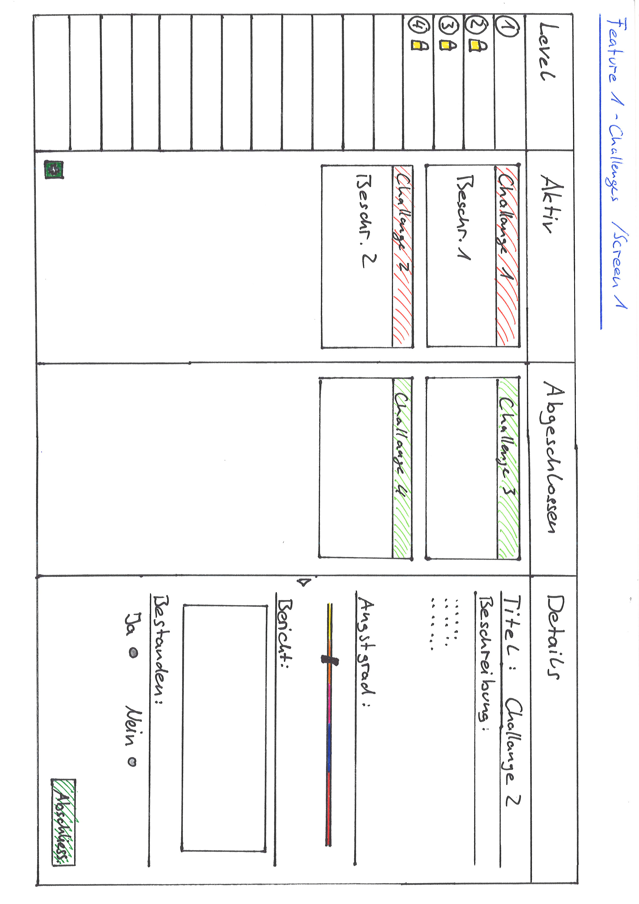
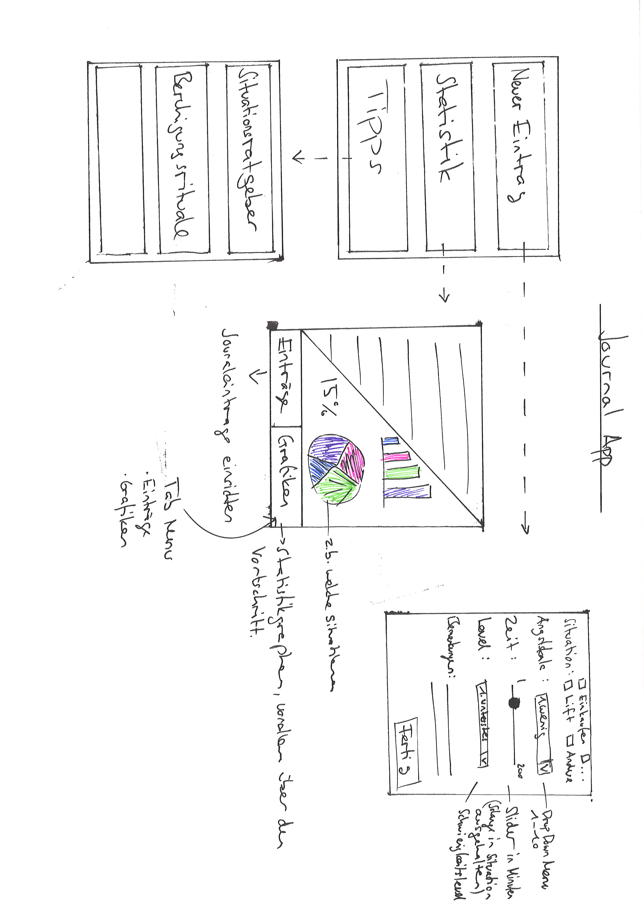

# Prototype

## Feature 1

Das Ziel dieses Features ist es Patienten die Möglichkeit zu geben ihre "Challanges" zu managen.
Wie wir in den Interviews festgestellt haben ist ein grosser Teil der Therapie die Hausaufgaben die die Patienten neben den Therapien erledigen zu haben. Dabei geht es darum, dass sich die Patienten solange ihren Ängsten aussetzten bis diese abklingen (Angst kann vom Körper nicht unbegrentzt aufrecht erhalten werden).

Unser Ziel mit diesem Prototype ist deshalb ein Tool bereitzustelllen was den Patienten Hilft ihre Challanges/Hausaufgaben zu managen. Als vorbild für unseren Prototype haben wir Storyboards gewählt denen man oft in Task verwaltungs tools begegnet.

### Levels

Die Challanges sind in Levels aufgeteilt, sie sind indikatoren für den Fortschritt des Patienten und für den Schwierigkeitsgrad der Aufgabe.

### Challanges

Sie sind das Herzstück des Features und repräsentieren die "Hausaufgaben" des Patienten.
Aufgeteilt werden sie nach Aktiv und Abgeschlossenen Aufgaben.

### Details

Im Details Fenster kann der Patient die Details dieser Aufgabe einsehen und diese Abschliessen nachdem er seinen Erfahrungsbericht eingetragen hat.

Hier wird der Screen für eine neue Aufgabe angezeigt.

## Feature 2

Ein wichtiger Teil der Therapie ist das Tagebuch/Journal. In diesem halten die Patienten ihren alltag fest und wann sie welche Schwierigkeiten hatten. Diese werden dann mit den Therapeuten besprochen. Züsätzlich haben wir für dieses Feature noch die Möglichkeit vorgesehen die persönliche Statistik einzusehen und sich Tipps zu holen.

## Feature 3

Wir konnten durch das Interview herausfinden, dass die Ängste der Patient sehr oft unbegründet sind. Deshalb haben wir uns gedacht diesem Problem mit fakten entgegen zu wirken. Dafür ist das 3te Feature gedacht.