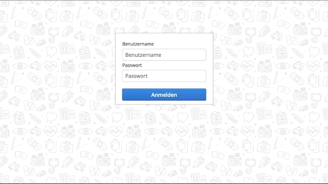

# Topic: (ambulant) patient & social anxiety disorder

- Thomas Baumann (lopof)
- Frédéric Lehmann (frediLehmann)
- Severin Thalmann (manfred00)
- Ismael Riedo (riedoi)
- Fridolin Zurlinden (ifrido)
- Roland Roccaro (MehrLinard)
- Tobias Weissert (supertoub)

####Run the Database first
`exec:java -Dexec.mainClass=org.hsqldb.Server "-Dexec.args=-database.0 file:target/social-anxiety-db`

####Run the Server
`package jetty:run`

####Login
- Username: **Jane** PW: *asdf*
- Username: **John** PW: *asdf*

##Challanges
####See your challanges
By clicking on the challenge button and Selecting the first Level you see all the challanges in this Level.

####Complete challanges
By selecting a challange you can see the details of this challenge on the left side, hier you have the possibility to close the challange. When you have closed all challages in a level, the next level gets unlocked.

####Create a new challange
By clicking the new challange button, you can create an new challange and asign it to a level.

##Journal
####See your journal entries
By clicking on the journal button, you can see all your jounralentries.

####Add a jounral entry
By clicking on the Button "Neuer Eintrag", you can create a new jounral entry about how you felt today.
