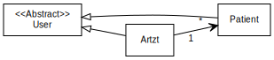
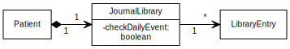
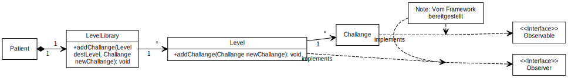

# Klassen Diagramm

[<Taks 04](../Task04.md)

Klassen Diagramm in kompletter Form

## Users

In diesem Diagramm sehen wir das detaillierte Klassen Diagramm für die User unseres Tools.

Wir haben für die Benuzter eine abstrakte Klasse "User", welche von den Klassen "Patient" und "Arzt" geerbt wird.
Die Klasse Arzt hat zusätzlich eine Referenz auf die Patienten Klasse. Das Ziel dabei ist, dass Ärzte die Möglichkeit haben auf die Fortschritte ihrer Patienten zuzugreifen.

## Journal

In diesem Diagramm sehen wir die Details der Journal Klasse.

Das Ziel des Journal ist es, dass Patienten eine Art Tagebuch führen können. Dafür haben wir eine Journal Library Klasse welche die Journal Einträge speichert und zusätzliche Funktionen bereitstellt.

## Challenges

Hier sehen wir die Details der Klasse für die Challenge.

Auch für die Levels haben wir eine Level Library welche die einzelnen Levels speichert. Die Level Klasse soll die einzelnen Challenges speichern. Zusätzlich haben wir uns entschieden für die Level und Challenge Klassen ein Observable Pattern zu verwenden. Ziel ist die Umkehrung der Abhängigkeit zwischen Level und Challenge. Die Interfaces "Observer" und "Observable" werden durch das Java Framework bereitgestellt, diese müssen nur noch implementiert werden.

## Data Layer Klassen

