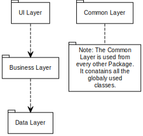
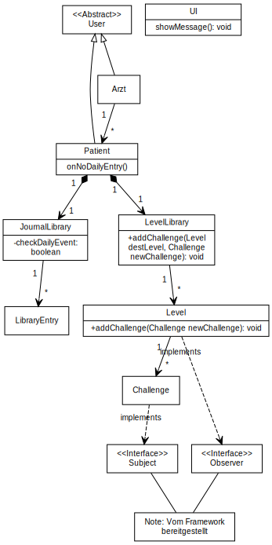

# Task 04

Notiz: Alle Diagramme wurden mit hilfe von yUML für Visual Studio Code erstellt. [Extension Details](https://marketplace.visualstudio.com/items?itemName=JaimeOlivares.yuml), [Extension Wiki](https://github.com/jaime-olivares/vscode-yuml/wiki)

## Package Diagramm

[Klassen Diagramm Details](./PackageDiagramm/PackageDiagramm.md)

## Klassen Diagramme

[Klassen Diagramm Details](./ClassDiagramms/ClassDiagramm.md)

## Sequenz Diagramme

[Sequenz Diagramm Details](./SequenzDiagramm/SequenzDiagramm.md)