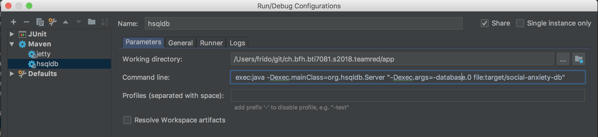

# Persistence 101
## Running hsqldb
Create new maven "Confugration" in IntelliJ:
    exec:java -Dexec.mainClass=org.hsqldb.Server "-Dexec.args=-database.0 file:target/social-anxiety-db

Always start hsqldb before running jetty.
## Running hsqldb manager
To debug the database and check/export the schema run from the commandline in the project directory:
    java -classpath app/target/social-anxiety-app-1.0-SNAPSHOT/WEB-INF/lib/hsqldb-2.4.0.jar org.hsqldb.util.DatabaseManager
With the SQL statement `SCRIPT /path/file.sql` you can dump the database.
## Sample data
Sample data is loaded into the database from the `initial_data.sql` file.

It overwrites all existing data, to turn this off comment the following line in the `persistence.xml`:
    <property name="hibernate.hbm2ddl.import_files" value="initial_data.sql"/>
And make sure to change the value `hibernate.hbm2ddl.auto` from `create` to `update`:
    <property name="hibernate.hbm2ddl.auto" value="update   " />

When adding sample data make sure to keep the right order, if you don't you may violate the constraints.
## Persistence usage
To use the Persistence instances simply get an instance with (for exapmle the PatientPersistence) `PatientPersistence.getInstance()`

To get the Patient from the session use this code:
    Patient patient PatientPersistence.getInstance().getByName(UI.getCurrent().getSession().getAttribute("user").toString());

To get a LevelLibrary wich is owned by the user use this code:
    LevelLibrary levelLibrary = LevelLibraryPersistence.getInstance().getById(patient.getLevelLibrary().getId())

To persist an entity simply create/modify the enttiy and use the `persist()` method:
    Challenge challenge = new Challenge(levelTitle + cTitle, cDesc, ChallengeState.open, level, lOfAx, this);
    ChallengePersistence.getInstance().persist(challenge);

# Logger 101
You can use the Logger basicly in any class (specify the right class as argument of the `getLogger` method):
    private static final Logger logger = LogManager.getLogger(ChallengePersistence.class);

For logging specify the log level and your message:
    logger.debug("Finished query getByTitle");
